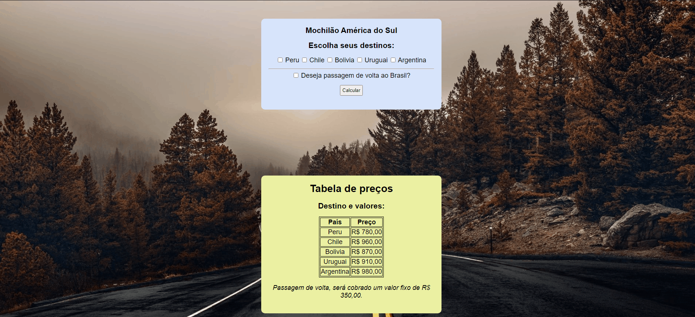

## Mochilão América do Sul

Programa para mostrar o custo de um mochilão para alguns países da América do Sul. Calculando sua passagem com base dos lugares selecionados.

*Obs:* Caso o usuário selecionar passagem de volta, será cobrado um valor fixo de R$ 350,00.

País | Passagem
:--------- | :------:
Peru |R$ 780,00
Chile |R$ 960,00
Bolivia |R$ 870,00
Uruguai |R$ 910,00
Argentina |R$ 980,00

### 🛠 Tecnologias

As seguintes ferramentas foram usadas na construção do projeto:

- HTML
- CSS
- Javascript

<h4 align="center"> 
	:computer: Projeto concluído :heavy_check_mark:
</h4>

*Link do projeto:* https://jvmsantos13.github.io/mochilao/

## Autor
João Victor Monteiro  
https://www.linkedin.com/in/jvmsantos/
